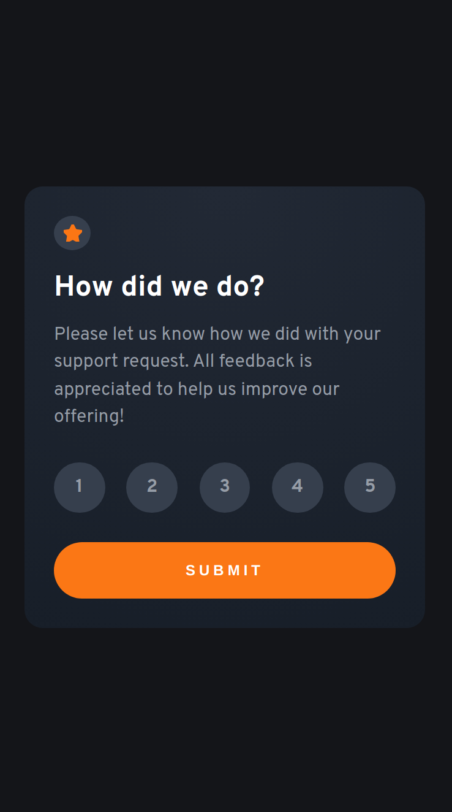
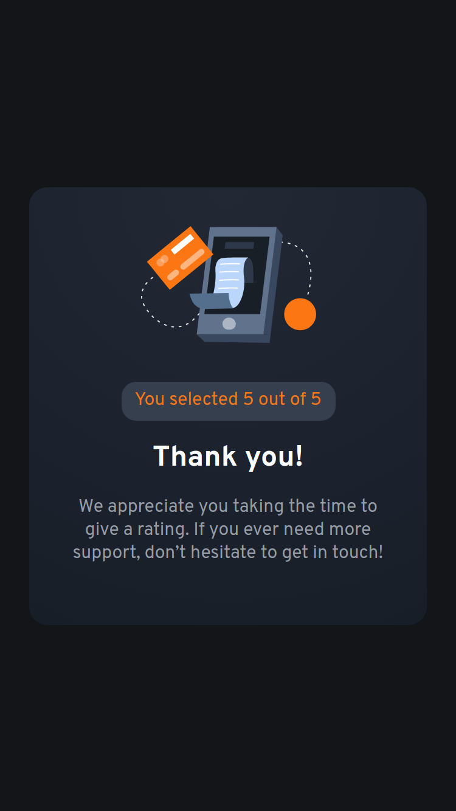
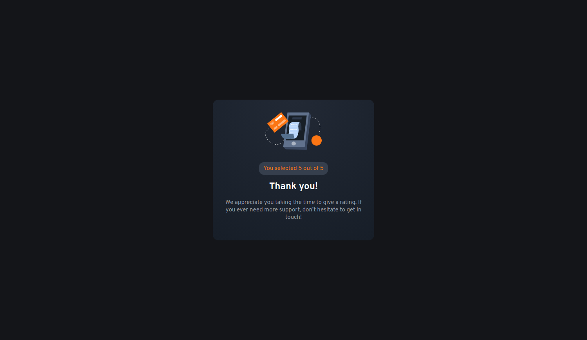

# Frontend Mentor - Interactive rating component solution

This is a solution to the [Interactive rating component challenge on Frontend Mentor](https://www.frontendmentor.io/challenges/interactive-rating-component-koxpeBUmI). Frontend Mentor challenges help you improve your coding skills by building realistic projects.

## Table of contents

- [Overview](#overview)
  - [The challenge](#the-challenge)
  - [Screenshot](#screenshot)
  - [Links](#links)
- [My process](#my-process)
  - [Built with](#built-with)
  - [What I learned](#what-i-learned)
  - [Continued development](#continued-development)
- [Acknowledgments](#acknowledgments)

## Overview

### The challenge

Users should be able to:

- View the optimal layout for the app depending on their device's screen size
- See hover states for all interactive elements on the page
- Select and submit a number rating
- See the "Thank you" card state after submitting a rating

### Screenshot

<strong>Mobile Version </strong>
 

 

<strong>Desktop Version </strong>
 

 

### Links

- Solution URL: [GitHub Solution](https://github.com/retop56/FrontendMentor---Interactive-Rating-Component)
- Live Site URL: [Live Site](https://retop56.github.io/FrontendMentor---Interactive-Rating-Component/)

## My process

### Built with

- Semantic HTML5 markup
- CSS custom properties
- Flexbox
- Vanilla Javascript
- Mobile-first workflow

### What I learned

- How to change states with JavaScript by toggling class names
- Adjusting text based on user input (in this case, the rating they choose)

### Continued development

- Continue using JavaScript to do cool and interesting dynamic changes on webpages

## Acknowledgments

Thanks to FrontendMentor for providing this great practice project!
